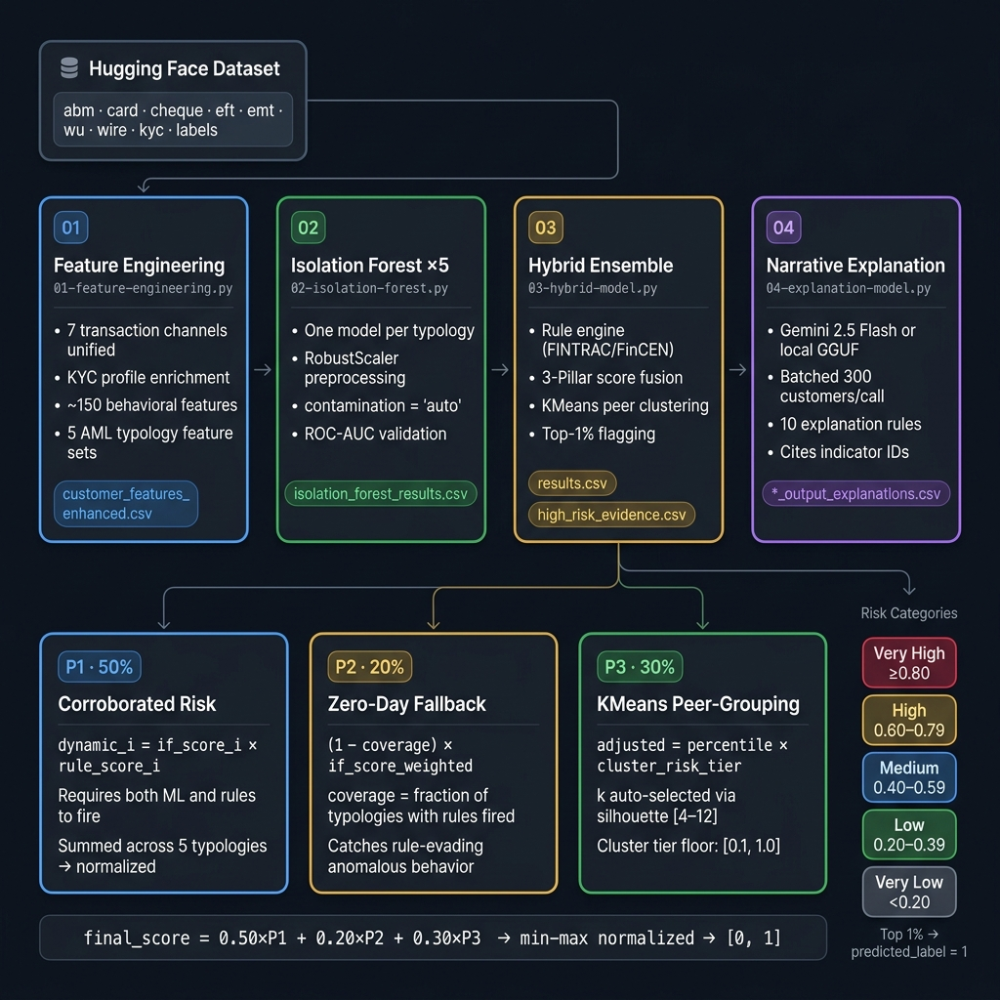

# IMI Big Data & AI — AML Detection System

Submission for the **2025–2026 IMI Big Data & Artificial Intelligence Competition** hosted by Scotiabank. The system is an end-to-end Anti-Money Laundering (AML) detection pipeline that scores, ranks, and explains customer risk using a hybrid ensemble of unsupervised machine learning, deterministic regulatory rules, and behavioral peer-grouping.



---

## System Architecture — 3-Pillar Hybrid Ensemble

The final risk score is a weighted combination of three independent pillars. Independence across pillars is a deliberate design constraint: no signal produced by one pillar feeds directly into another.

```
final_score = 0.50 × dynamic_score_norm
            + 0.20 × (1 − coverage) × if_score_weighted
            + 0.30 × adjusted_kmeans_score
```

### Pillar 1 — Corroborated Risk `(weight: 0.50)`
A multiplicative gate requiring **both** the rule engine and the Isolation Forest to agree before a customer scores highly. For each of the 5 typologies, the rule score and the IF anomaly score are multiplied together:

```
dynamic_i = rule_score_i × if_score_i
```

The sum across typologies is min-max normalised across the full population. A customer who saturates the rules but has a low IF anomaly score (or vice versa) cannot reach a high Pillar 1 score. Both independent models must fire together.

### Pillar 2 — Zero-Day Fallback `(weight: 0.20)`
A safety net for sophisticated actors who evade all deterministic rule thresholds. The fallback contribution scales with *inverse coverage* — the fraction of typologies where no rule fired:

```
pillar_2 = (1 − coverage) × if_score_weighted
```

When all five typologies produce rule signals (`coverage = 1.0`), Pillar 2 contributes nothing. When no rules fire (`coverage = 0.0`), the IF score carries its full 0.20 weight. This ensures purely anomalous behavior can still surface even without any hard regulatory flag.

### Pillar 3 — Behavioral Peer-Grouping `(weight: 0.30)`
KMeans clustering on the 5 raw IF anomaly scores groups customers into behavioral archetypes. The cluster count is selected automatically by silhouette score over k ∈ [4, 12], with a thin-cluster refit safeguard (minimum 200 members per cluster).

Within each cluster, customers are ranked by their `if_score_mean` percentile relative to their peers. The percentile is scaled by the cluster's baseline risk tier (normalised to [0.1, 1.0] across clusters):

```
adjusted_kmeans_score = within_cluster_percentile × cluster_risk_tier
```

The [0.1, 1.0] floor on the risk tier ensures that even the safest cluster contributes a non-zero Pillar 3 score — preventing a cluster assignment from acting as a blanket exemption for sophisticated actors who deliberately keep their behavior "just normal enough."

---

## AML Typology Coverage

The pipeline is structured around five FINTRAC/FinCEN typologies, each with a trained Isolation Forest and a dedicated rule module:

| Typology | IF Weight | Key Indicators |
|----------|-----------|---------------|
| Structuring & Layering | 0.30 | Sub-$10K cash deposits, velocity bursts, flow-through ratio, round sums |
| Behavioural & Profile Anomalies | 0.20 | Dormant activation, credit surge, spending vs. income, abrupt changes |
| Trade-Based ML & Shell Entities | 0.25 | Pass-through gatekeeper accounts, EFT spikes, volume/sales mismatch |
| Cross-Border & Geographic Risk | 0.13 | FATF blacklist, drug-transit jurisdictions, offshore/underground banking |
| Human Trafficking | 0.12 | Multi-city ABM + night cash, accommodation spend, HT source countries, adult MCC after-hours |

Typology weights reflect relative feature richness. Cross-border and human trafficking are downweighted due to data sparsity in the competition dataset.

Rule-based thresholds are grounded in FINTRAC regulatory guidance and industry references including [CheckFile — AML Transaction Monitoring Rules, Thresholds & Red Flags](https://www.checkfile.ai/en-US/blog/aml-transaction-monitoring-rules-thresholds-red-flags).

---

## Pipeline Stages

| Script | Primary Input | Primary Output | Role |
|--------|--------------|----------------|------|
| `01-feature-engineering.py` | Raw transaction & profile data (HF) | `customer_features_enhanced.csv` | Derives ~150 behavioral features per customer |
| `02-isolation-forest.py` | `customer_features_enhanced.csv` | `isolation_forest_results.csv` | Trains 5 typology-specific Isolation Forests; produces per-typology anomaly scores |
| `03-hybrid-model.py` | Features + IF results | `hybrid_model_results.csv`, `high_risk_evidence.csv` | Applies rule engine, computes 3-pillar ensemble score, runs KMeans clustering |
| `04-explanation-model.py` | `high_risk_evidence.csv` | `*_output_explanations.csv` | Generates plain-language analyst narratives via Gemini or local LLM |

All intermediate and output files are stored in the `outputs/` folder of the Hugging Face dataset repo.

---

## Output Files

| File | Contents | Consumer |
|------|----------|---------|
| `results.csv` | `customer_id`, `predicted_label`, `risk_score` | Competition submission |
| `hybrid_model_results.csv` | Full scored population with all pillar components | Audit / analysis |
| `hybrid_model_high_risk.csv` | Customers scoring > 0.60 | Operational alert list |
| `high_risk_evidence.csv` | Customers scoring > 0.50 with full evidence fields | Input to explanation model |
| `*_output_explanations.csv` | Plain-language investigative narratives | AML analyst review |
| `cluster_typology_profile.csv` | KMeans cluster risk tier and primary typology | Cluster audit |
| `kmeans_model.pkl` / `kmeans_k.pkl` | Serialised KMeans model and selected k | Inference reproducibility |

---

## Reference Documentation

| File | Contents |
|------|----------|
| [`reference docs/03 - AML-rule-based-flags.md`](reference%20docs/03%20-%20AML-rule-based-flags.md) | Full rule indicator catalogue with FINTRAC/FinCEN grounding |
| [`reference docs/04 - hybrid-architecture.md`](reference%20docs/04%20-%20hybrid-architecture.md) | Detailed 3-pillar ensemble architecture and design decisions |
| [`reference docs/05 - explanation-structure.md`](reference%20docs/05%20-%20explanation-structure.md) | Explanation engine architecture: two-layer evidence design, system prompt structure, batch processing |
| [`reference docs/pipeline-review-log.md`](reference%20docs/pipeline-review-log.md) | Audit log of all issues identified and fixes applied across pipeline scripts |
| `reference docs/01 - data fields.pdf` | Competition dataset field definitions |
| `reference docs/02 - AML-features.pdf` | Feature engineering specification |
| `AML-indicator-DB.csv` | Master indicator database (36 indicators across 5 typologies) used by rule engine and explanation model |